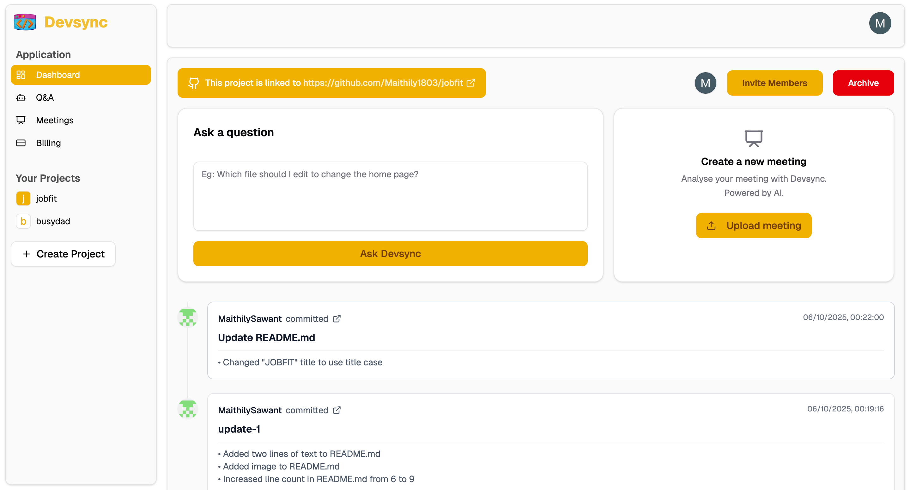
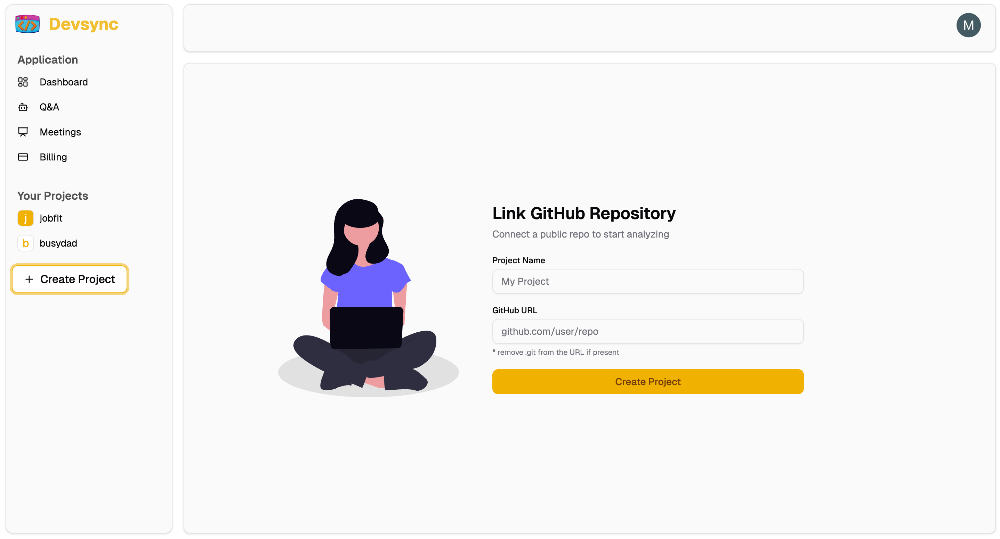
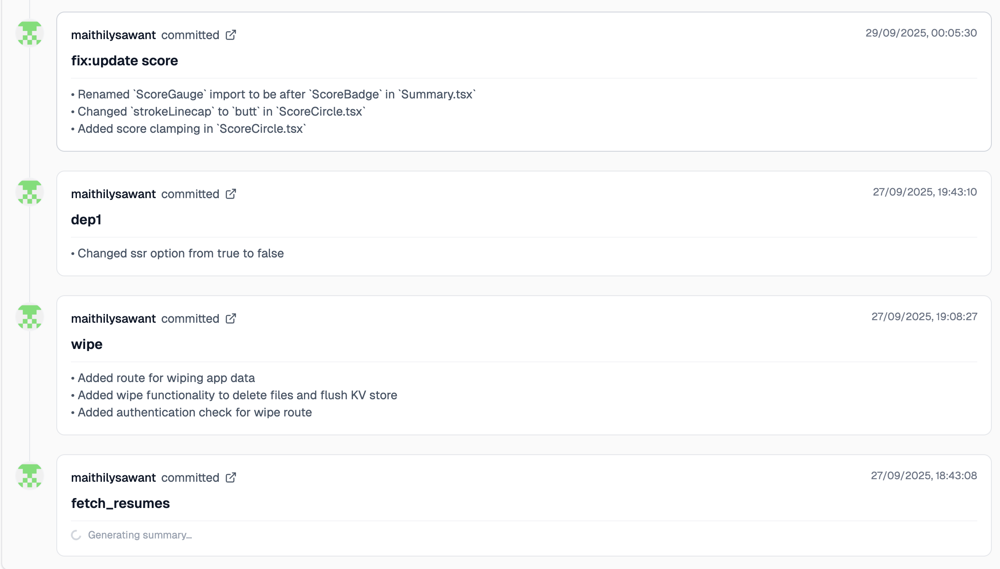
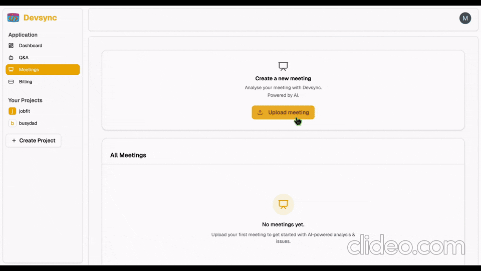
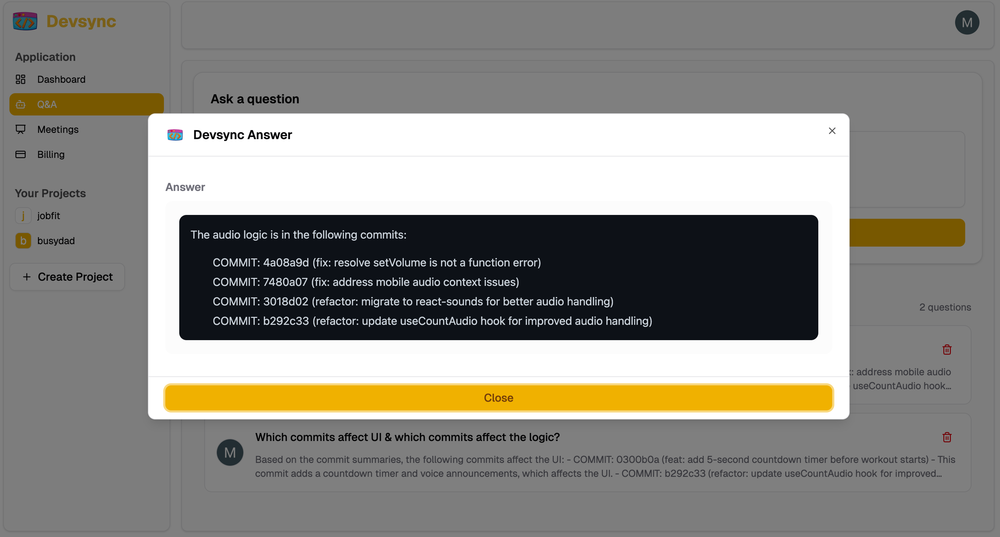
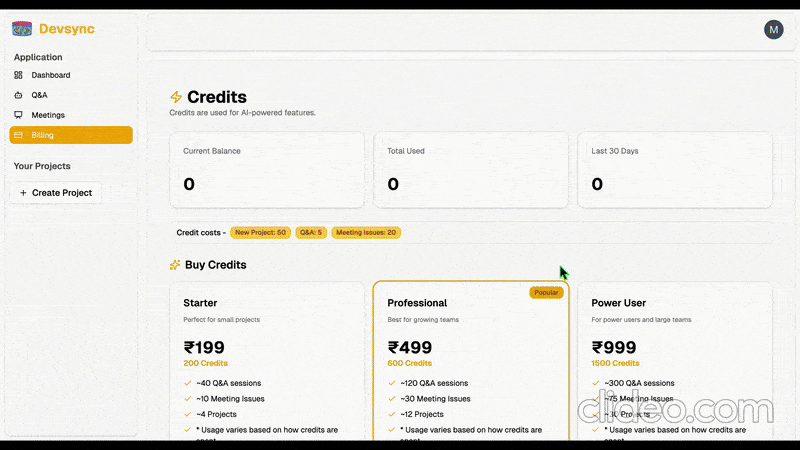
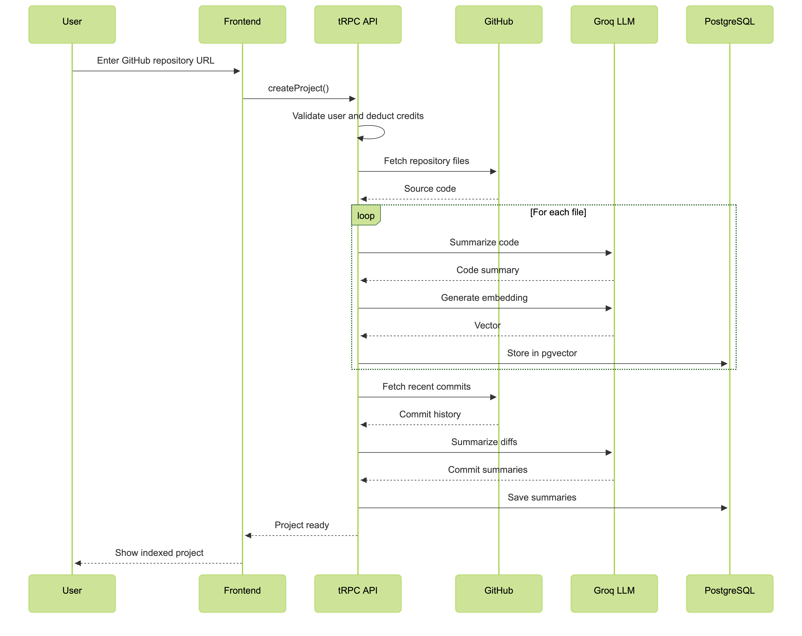
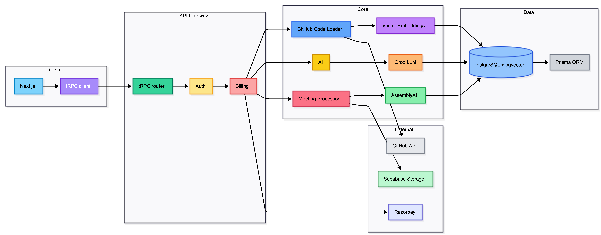

# 

### **`Search your code. Understand your meetings. Instantly.`**

---

## 🧩 Dashboard 

  

## 🎬 Product Tour

  
<strong>Create Project</strong>

   
  

    
  

  
<strong>Commit Log</strong>

   
  

    
  

  
<strong> Meeting Issues </strong>

   
  

    
  

  
<strong>Q&A</strong>

   
  

    
  

  
<strong> Billing </strong>

   
  

    
  

---
## ✨ Features

- **`Q&A`**  
  Ask questions about your codebase and get instant, context-aware answers with file references.

- **`Commit Analysis`**  
  Turns raw git commits into readable AI summaries with smart diff understanding.

- **`Meeting Issue Detection`**  
  Extracts issues, tasks, and priorities from meeting recordings.
-----

  ## ⚙️ System Breakdown

  
<strong> Architecture </strong>

   
  

    
  

  
<strong> Workflow </strong>

   
  

    
  

---
## 🛠️ Built with

  
  
  
  
  
  
  

  
  
  
  
  
  

---
## 👀 Explore DevSync. See the intelligence. ⭐ if it helps.
**`Made with ❤️ and ☕`**

